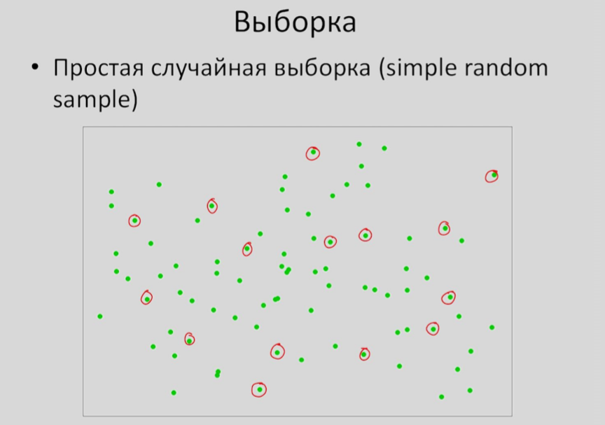
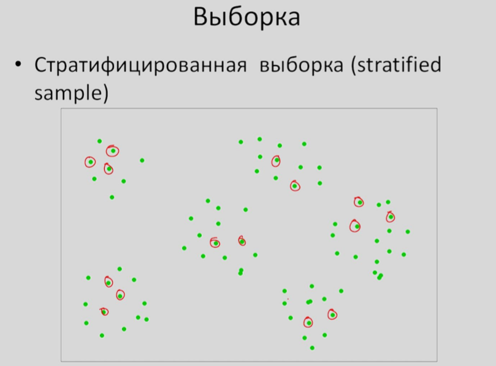
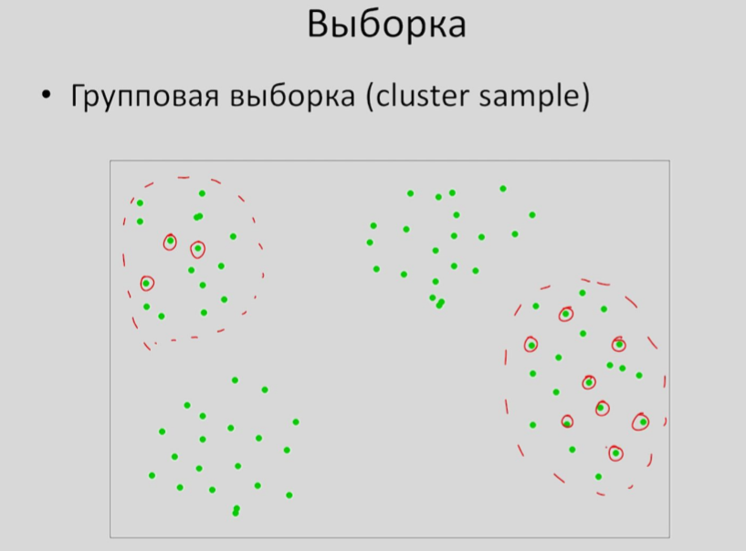

# Генеральная совокупность и выборка

* Понятие генеральной совокупности и выборки, репрезентативность выборки
* Простая случайная выборка
* Стратифицированная выборка
* Групповая выборка

**Генеральная совокупность \(ГС\)** - множество всех объектов, относительно которых делается выводы в рамках исследования


_Пример :_ Представьте, что у вас есть котел каши и вы хотите узнать, соленая ли она. При условии, что каша хорошо перемешана, не обязательно съедать всю кастрюлю - достаточно попробовать одну ложку.


**Выборка** - часть генеральной совокупности элементов, которая охватывает экспериментом \(наблюдение, опрос и т.д.\)

Виды методов для формирования _репрезентативной_ выборки:

* Простая случайная выборка \(simple random sample\)
* Стратифицированная выборка \(stratified sample\)
* Групповая выборка \(cluster sample\)

**Простая случайная выборка** - случайным образом выбираем элементы генеральной совокупности. При увеличение случайной выборки, она будет все больше напоминать ГС по своим характеристикам.

**Стратифицированная выборка** - перед тем как случайным образом извлекать элементы ГС, с начала разобьем ГС на несколько обособленных и различных _страт_ \(групп\). 


_Например:_ если мы хотим чтобы в нашем исследовании равновероятно приняло участие как мужчины, так и женщины. Мы сначала можем разделить ГС по признаку пола, а потом используя метод _случайной выборки_ из каждой страты выбрать набор элементов для участия в нашем исследование.


**Групповая выборка** - разделим ГС на несколько кластеров \(групп\), однако в данном случае все кластеры напротив - будут очень сильно похоже между собой. Зачастую такой метод используется для экономии ресурсов и времени при формирования выборки.


_Например:_ мы можем разделить Астану на несколько районов, и быть уверенным в том, что в принципе население данных районов несильно отличаются друг от друга. Поэтому мы можем выбрать только несколько кластеров для участия в нашем исследовании. А затем методом случайной выборки, из выбранных кластеров выбрать набор элементов для участия в эксперименте.


Примеры:



Для того чтобы протестировать курс по введению в статистику и выяснить, насколько хорошо с ним справятся студенты Института биоинформатики, случайным образом было выбрано 50 студентов института.



Для исследования взаимосвязи риска развития заболевания и группы крови человека потенциальных участников исследования разделили на четыре группы \(в соответствии с группой крови\). Затем из каждой группы случайным образом извлекли по 50 человек.



Чтобы проверить знания школьников Санкт-Петерубрга по математике, было организовано исследование. Случайным образом было выбрано 10 школ, затем из каждой школы случайным образом было отобрано по 50 учащихся разных классов.



