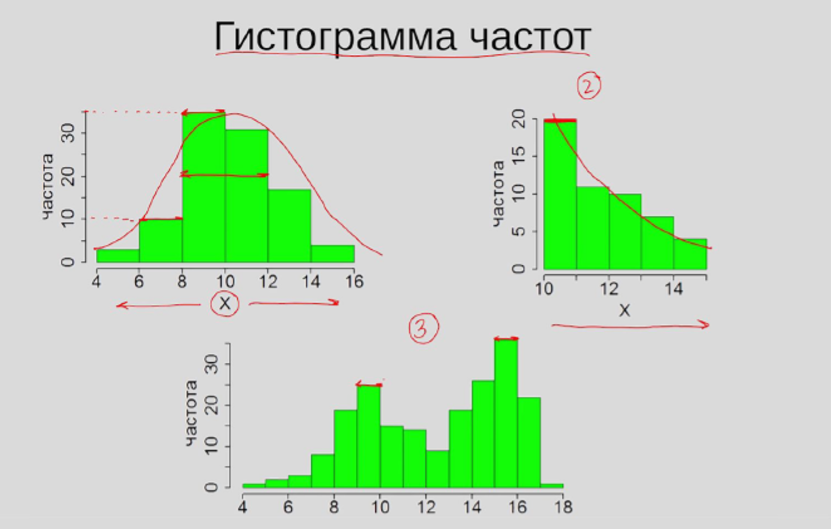
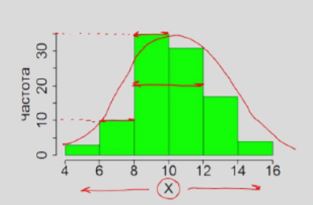
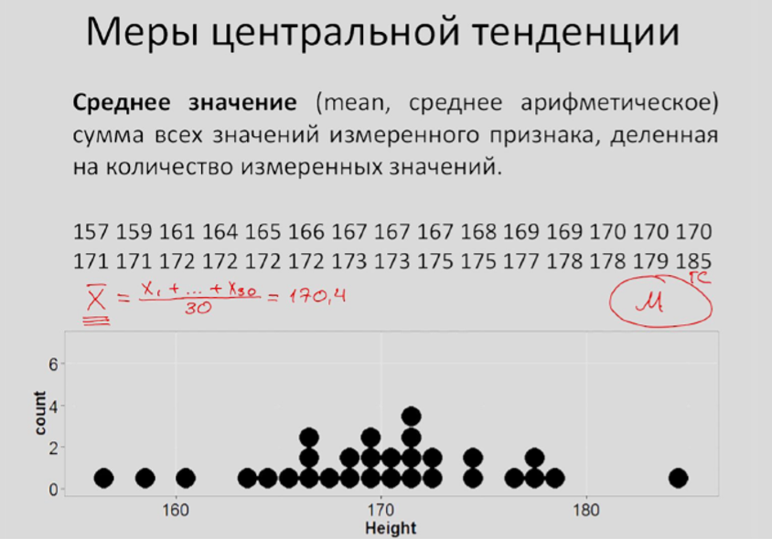

# Меры центральной тенденции

* Мода
* Медиана
* Среднее значение
* Выбор меры центральной тенденции
* Свойства среднего

Распределение количественного признака, для этого используется гистограмма частот.

Этот график позволяет сделать первое впечатление о том, какая форма распределения нашего количественного признака.

**Симметричное распределение** - когда большинство наблюдений в центре распределения, и чем дальше мы отклоняемся от середины распределения, тем реже встречаются значения признака.

**Мода \(mode\)** – значение признака, которое встречается максимально часто.

**Медиана \(median\)** – значение признака, которое делит упорядоченное множество данных пополам.

**Среднее значение \(mean\)** – сумма всех значений признака, деленная на количество измеренных значений.

$$
\overline{X} = \frac{\sum_{i}^{n} x_i}{n}
$$

Выборочное среднее:

$$
\overline{X}
$$

Среднее ГС:

$$
M_x
$$


В каких случаях вместо среднего значения лучше использовать моду или медиану в качестве центральной тенденции?

* [x] Если распределение асимметрично
* [x] Если присутствуют заметные выбросы
* [ ] Если распределение является симметричным и унимодальным


**Свойства среднего:**

$$
M_x = \frac{1}{n} \sum x_i \\
M_{x + C} = M_x + C \\
M_{x*C} = M_x * C \\
\sum(x_i - M_x) = 0
$$


Предположим, вы провели исследование с целью выяснить, какой доход у граждан, проживающих в двух разных городах \(по 100 человек из каждого города\). Распределение заработной платы изображено на графике. Какую из мер центральной тенденции осмысленнее всего использовать для описания полученных данных?

* [x] Мода \(моды\)
* [ ] Медиана
* [ ] Все три меры дадут приблизительно одинаковый результат
* [ ] Среднее значение

Ну явно тенденция - это два пика. И соответственно 2 моды отобразят ее лучше, чем серединка между пиками в виде среднего значения и медианы.


