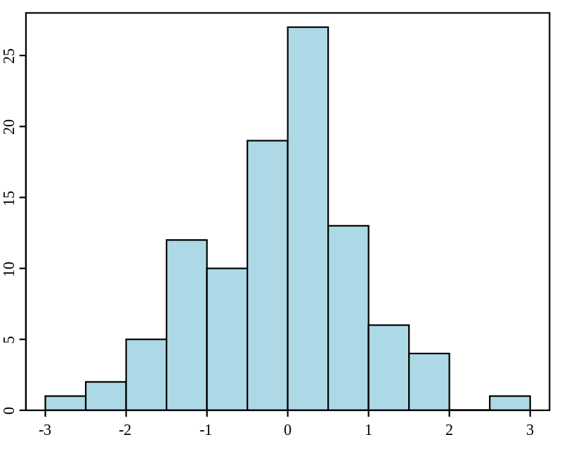
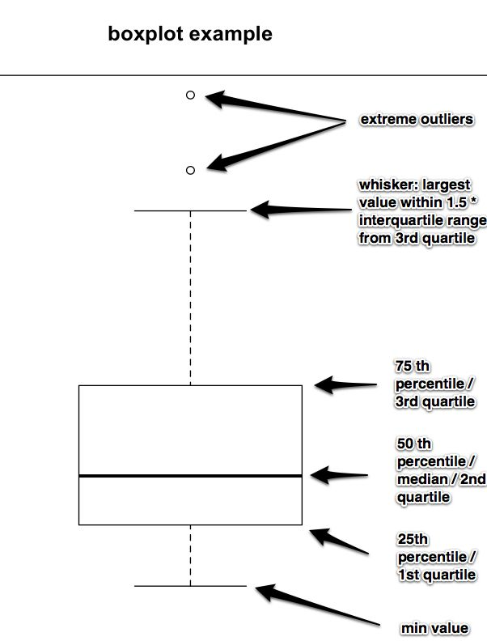
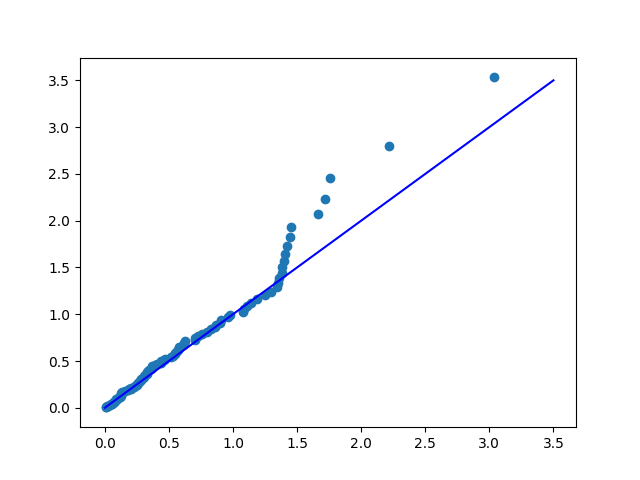
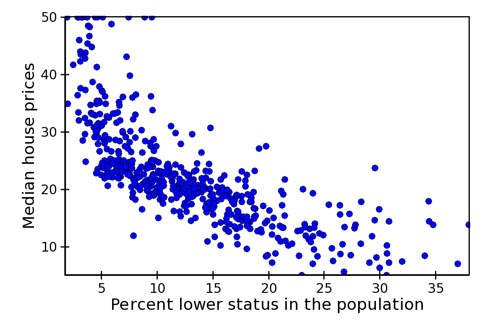

# Описательная статистика

**Описательная статистика** - занимается обработкой эмпирических данных, их систематизацией, наглядным представлением в форме графиков и таблиц, а также их количественным описанием посредством основных статистических показателей.

**Histogramm \(гистограмма\)** - график, показывающий как часто значение переменной встречается на определенном промежутке.

**Dot plot \(точечный график\)** - график, в котором каждой точке соответствует одно значение выборки.

**Box plot \(ящик с усами\)** -  график, показывающий медиану, нижний и верхний квартили, минимальное и максимальное значение выборки и выбросы. В ящик попадют значения \(50% измерений\), лежащих между квантилями  и . Вверх и вниз от ящика исходят два отрезка равные , то есть полтора межквартильных размаха. Точки, превышающие с своем отклонении полтора межквартильных размаха, отображаются отдельно.

**Q-Q plot \(график квантиль-квантиль\)** – показывает насколько выборочное значение соответствует нормальному распределению, линия – идеальное нормальное распределение.

**Scatter plot \(диаграмма рассеяния\)** – диаграмма, изображающая значения двух переменных в виде точек на декартовой плоскости.

