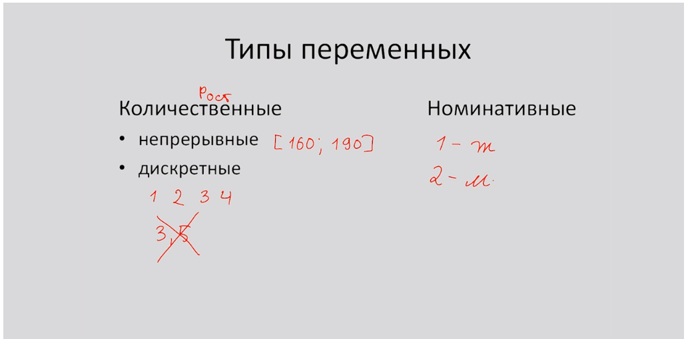

# Типы переменных. Количественные и номинативные переменные

* Типы переменных
* Количественные переменные
* Номинативные переменные
* Ранговые переменные

В целом все типы переменных можно разделить на 2 большие группы:

* Количественные
* Номинативные

Таблица - каждая строка номер испытуемого, а каждый столбец это различные характеристики \(признаки\) испытуемого \(элемента\).

**Количественные переменные** представляют собой измеренные значения некоторого признака. 


Например, _рост испытуемого,_ если наша переменная может принимать абсолютно любое значение на некотором промежутке, то такая переменная будет называться **непрерывной**. 


В случае **дискретных** переменных, мы ожидаем что наша переменная будет принимать только определенные значения, например, _число детей_ в семье.

**Номинативные переменные \(categorical\)** - используется для разделения на группы. Например, мы можем обозначить всех участников женского пола - "1", а мужчин - "2". 

**Ранговые переменные.** 

Представим что у нас есть информация о марафонском забеге. Кто-то прибежал первым, кто-то вторым и т.д. Мы можем сказать что испытуемые с рангом "1" быстрее чем испытуемый с рангом "5". Но мы не можем сказать во сколько раз быстрее. Только сравнить - кто быстрее, кто медленнее.

